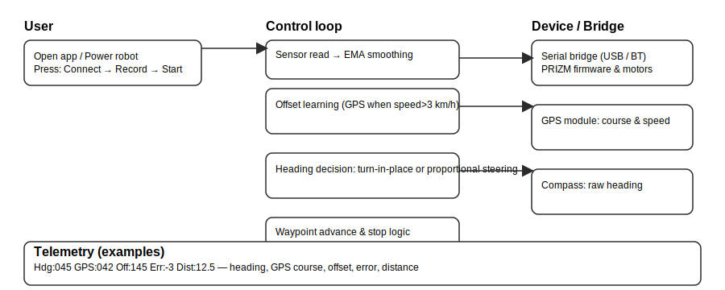

# 🤖 WavyPoint Robo — Waypoint Navigation Robot (Beginner-friendly)

A compact, easy-to-run waypoint navigation robot using GPS and a QMC5883P compass with automatic boresight offset learning. Designed to help beginners and tinkers see results fast, and to give embedded developers a clear, well-documented codebase to extend.

TL;DR — Try in 5 minutes

1. Clone: git clone https://github.com/robocop-20/wavypoint-robo && cd wavypoint-robo
2. Open the firmware folder in Arduino IDE, install the listed libraries, and upload to your PRIZM controller
3. Power the robot, wait for "Ready. Auto-Align Active." and watch telemetry via Bluetooth or follow the demo flowchart in the README

Why this project

- Instant feedback: a demo-first README and interactive flowchart make it easy to understand what the robot does in seconds.
- Beginner friendly: step-by-step Quickstart and plain-language explanations.
- Extensible: clear architecture notes and contribution guidelines for faster improvements.

Features

- Waypoint-based autonomous navigation (Haversine for distance + automatic waypoint advance)
- Automatic compass boresight offset learning (uses GPS course while moving)
- GPS smoothing (EMA) and hybrid heading control for reliable tracking
- Bluetooth telemetry for live monitoring and debugging

Who this is for

- Beginners who want a simple, visual robotics project
- Educators teaching navigation, sensors, and control loops
- Embedded developers who want a small, demonstrable codebase to hack on

Quick links

- Try in 5 minutes: (see TL;DR above)
- Flowchart (visual): assets/flowchart.svg
- Flowchart (text): docs/Flowchart-text.md
- Contributing: CONTRIBUTING.md

---

## 🔧 Hardware (short)

| Component | Model | Purpose |
|-----------|-------|---------|
| Controller | PRIZM | Motor control |
| Compass | QMC5883P | Magnetic heading |
| GPS | UBLOX | Position & course |
| Motors | DC Motors | Differential drive |
| Bluetooth | HC-05 | Telemetry |
| Encoders | (optional) | Odometry validation |


## 📊 Flowchart — overview



If the image doesn't display on GitHub, open docs/Flowchart-text.md for an accessible step-by-step walkthrough.

This pipeline (short):
- Startup & compass calibration
- GPS lock & smoothing
- Offset learning when moving (GPS course as ground truth)
- Heading decision (turn-in-place vs proportional steering)
- Waypoint tracking and advance

---

## 🚀 Getting Started (Beginner path)

Prerequisites
- Arduino IDE
- PRIZM support libraries + Adafruit QMC5883P + TinyGPSPlus

Installation & upload
1. git clone https://github.com/robocop-20/wavypoint-robo
2. Open firmware/ in Arduino IDE
3. Install libraries (Sketch → Include Library → Manage Libraries...)
4. Edit waypoints in firmware (if desired)
5. Upload to PRIZM and power the robot

Quick test
- Robot will run a 10s compass calibration at boot and print: "Ready. Auto-Align Active." via Bluetooth
- When moving >3 km/h, the compass offset will auto-adjust using GPS course

Telemetry example (Bluetooth)
```
Hdg:045 GPS:042 Off:145 Err:-3 Dist:12.5
Hdg:046 GPS:041 Off:144 Err:-2 Dist:11.3
```

Field meanings
| Field | Meaning |
|-------|---------|
| Hdg | Compass heading (0–359°) |
| GPS | GPS course |
| Off | Learned boresight offset |
| Err | Heading error to target |
| Dist | Distance to waypoint (m) |

---

## ⚙️ Configuration (quick)

GPS
```cpp
GPS_Serial.begin(9600);  // set to your module baud rate
```

Compass
```cpp
const bool AUTO_LEARN_OFFSET = true;
const float declinationDeg = -0.6;
```

Navigation params
```cpp
const int CRUISE_SPEED = 50;
const int TURN_SPEED = 45;
const float WHEEL_RADIUS = 0.045;
const float WHEEL_BASE = 0.34;
```

Waypoints
```cpp
NavPoint waypoints = {
  {17.780223, 83.375458},
  {17.780277, 83.375477},
  {17.780322, 83.375368}
};
```

---

## 🐛 Troubleshooting (common)

- Compass heading wrong: try axis mapping modifications in firmware (SENSOR_AXIS_FORWARD / SENSOR_AXIS_RIGHT)
- GPS not updating: verify baud rate & wiring
- Offset not converging: ensure the robot moves faster than 3 km/h during initial learning
- Robot spinning: check motor invert settings

---

## 🤝 Contributing (short)

Contributions welcome! See CONTRIBUTING.md for setup, style, and how to open a helpful PR (include a short demo GIF or screenshot if possible).

---

## 🎯 Roadmap (help wanted)

- IMU integration (better odometry)
- Path planning improvements
- Web dashboard for live telemetry
- Multi-waypoint upload via Bluetooth

---

## 📧 Contact

Open an issue or pull request. If you want a shoutout in the README demo section, add a PR with the demo media and I'll include it.

**Built with ❤️ — beginner-first, extendable, and fun to hack on.**
